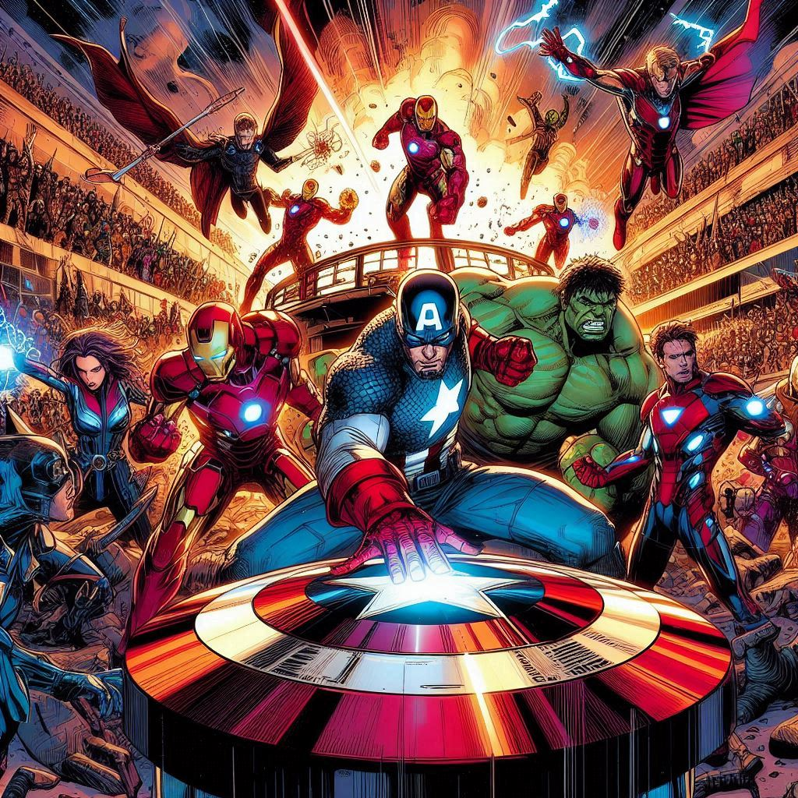
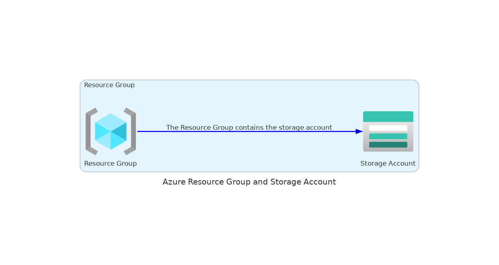
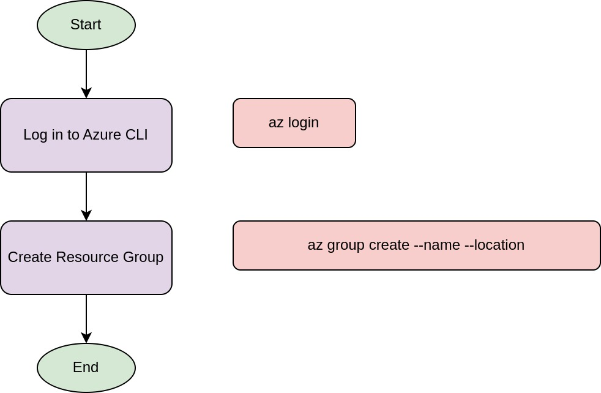
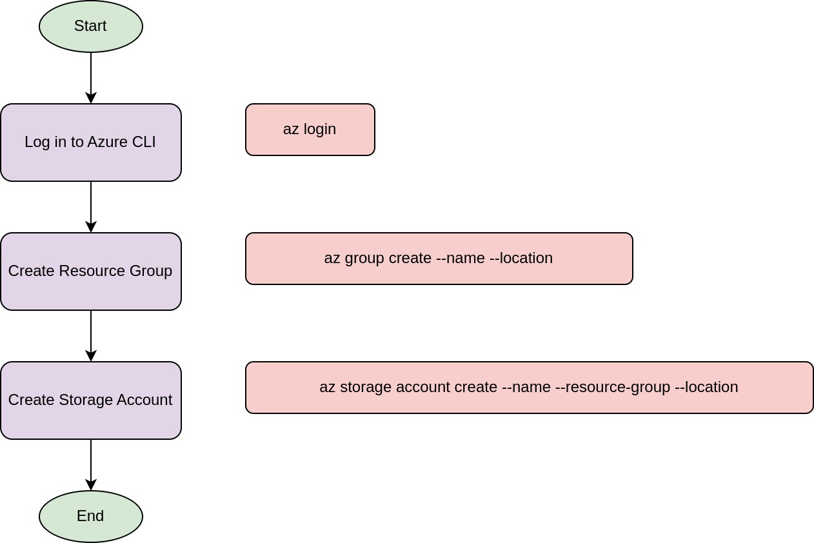
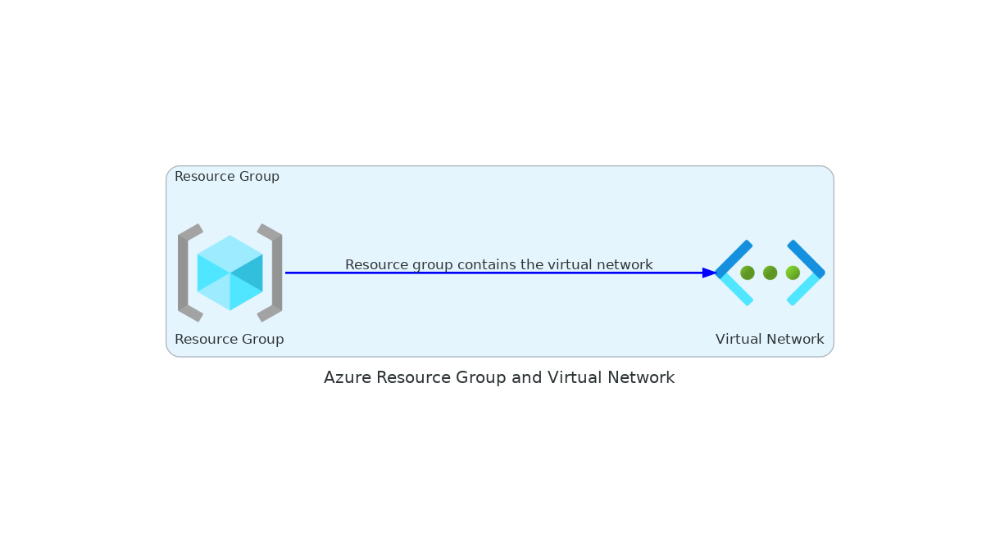
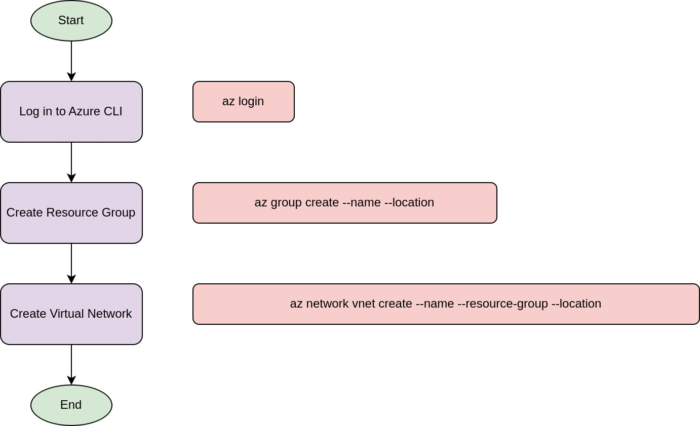
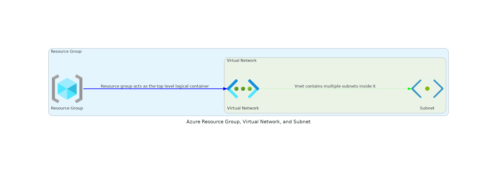

### Level 1: Recruit the Heroes (Beginner)

- **Level 1: Recruit the Heroes**
  - "Welcome to the first level, Avengers! In this mission, you’ll learn how to provision basic Azure resources using the power of Azure Copilot. Just like assembling the Shield base, you’ll set up fundamental components that form the backbone of your infrastructure."

- **Overview of Missions:**
  - "You have two main missions: Provision the Shield Base and Assemble the Communication Channels. Let's dive into the details!"

#### Mission 1 – Provision the Shield Base

---

**Content:**

- **Mission Objective:**
  - "Your first mission is to provision the Shield Base by creating an Azure Resource Group and a Storage Account. These are essential for organizing and storing your resources."

- **Task Details:**
  - "You’ll use Azure Copilot to guide you through the code needed to create these resources efficiently."

---

#### Task Guide – Creating an Azure Resource Group

---

**Content:**

- **Introduction to Azure Resource Group:**
  - "An Azure Resource Group is a container that holds related resources for an Azure solution. It’s the first step in organizing your resources."

- **Using Azure Copilot:**
  - "Azure Copilot can help you quickly generate the code needed to create a Resource Group."

**Guide:**
  - "Heroes, to create your foundation, whisper these words to Azure Copilot: 'In the East, where the sun rises, gather my forces under one name, strong and wise.'"

---

#### Task Guide – Creating an Azure Storage Account

---

**Content:**

- **Introduction to Azure Storage Account:**
  - "An Azure Storage Account provides a unique namespace for your Azure Storage data objects. It’s essential for storing your application data."

- **Using Azure Copilot:**
  - "Azure Copilot assists in writing the code to create a Storage Account with specific properties."

**Guide:**
  - "To store your secrets and treasures, you must say, 'In the realm of Azure, build me a vault with standard locks, where my data stays safe from shocks.'"

**Challenge:**
  - "Ensure your vault is guarded with redundancy as strong as Thor’s hammer. How will you configure your lock to withstand any hammering?"

| Property                       | Description                                                                                          |
|--------------------------------|------------------------------------------------------------------------------------------------------|
| **Account Name**               | A unique name to identify your storage account within Azure.                                          |
| **Resource Group**             | The Azure Resource Group where the storage account resides.                                           |
| **Location**                   | The Azure region where the storage account is created.                                                |
| **SKU (Pricing Tier)**         | The pricing tier (Standard or Premium) that determines the performance and cost of the storage account.|
| **Replication**                | The replication strategy (LRS, GRS, RA-GRS, ZRS) to ensure data redundancy and availability.          |
| **Access Tier**                | The access tier (Hot, Cool, Archive) for Blob Storage to manage storage costs based on data usage.    |
| **Encryption**                 | Specifies whether data in the storage account is encrypted.                                           |
| **Network Access**             | Controls access to the storage account from specific virtual networks or IP address ranges.            |
| **Identity**                   | Managed identities assigned to the storage account for Azure services authentication.                 |
| **Tags**                       | Key-value pairs to categorize and manage resources.                                                   |
| **Kind**                       | The type of storage account (StorageV2, BlobStorage, FileStorage, BlockBlobStorage).                  |
| **Endpoints**                  | The URLs used to access data in the storage account (Blob, File, Queue, Table endpoints).             |
| **Provisioning State**         | The current state of the storage account (e.g., Succeeded, Creating, Deleting).                      |
| **Primary and Secondary Keys** | Access keys for programmatic access to the storage account.                                           |
| **Blob Soft Delete**           | Enables the soft delete feature for Blob storage to recover deleted blobs.                            |
| **File Soft Delete**           | Enables the soft delete feature for File storage to recover deleted files.                            |
| **Large File Shares**          | Enables support for large file shares up to 100 TiB.                                                  |
| **Static Website Hosting**     | Enables hosting of static websites in the storage account.                                            |
| **Minimum TLS Version**        | Specifies the minimum TLS version required for requests to the storage account.                       |

---

#### Mission 2 – Assemble the Communication Channels

---

- **Mission Objective:**
  - "Your second mission is to set up the communication channels by creating a Virtual Network and a Subnet. These are crucial for network connectivity and security."

- **Task Details:**
  - "Leverage Azure Copilot to write the necessary code for configuring networking components."

---

#### Task Guide – Creating a Virtual Network

---

- **Introduction to Virtual Network:**
  - "An Azure Virtual Network (VNet) is the fundamental building block for your private network in Azure. It enables many types of Azure resources to securely communicate with each other."

- **Using Azure Copilot:**
  - "Azure Copilot can help generate the code to create a Virtual Network."

**Guide:**
  - "Weave a web for your heroes to communicate. Whisper to Azure Copilot: 'Create for me a net, 10.0.0.0/16 it shall be, in the East, where it’s meant to be.'"

---

#### Slide 7: Task Guide – Creating a Subnet

---

**Content:**

- **Introduction to Subnet:**
  - "A Subnet is a range of IP addresses in your Virtual Network. Subnets enable you to segment the VNet into smaller, manageable sections."

- **Using Azure Copilot:**
  - "Azure Copilot can assist in writing the code to create a Subnet within your VNet."

**Guide:**
  - "To split your net into sections fine, whisper to Azure Copilot: 'A subnet I require, 10.0.0.0/24, under my net, securely in line.'"

**Challenge:**
  - "Ensure your subnet is as secure as Asgard's gates. How will you configure it to allow only the necessary traffic, keeping enemies at bay?"

---

#### Quick Recap

---

- **Mission Recap:**
  - "Great job, Avengers! You have successfully provisioned the Shield Base and assembled the communication channels using Azure Copilot. You've created a Resource Group, a Storage Account, a Virtual Network, and a Subnet."

- **Q&A Session:**
  - "Do you have any questions or need further clarification on any of the tasks? Let's discuss your experiences and any challenges you faced."