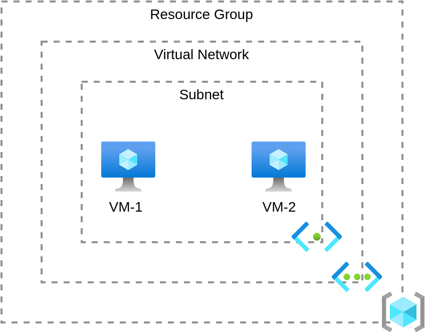
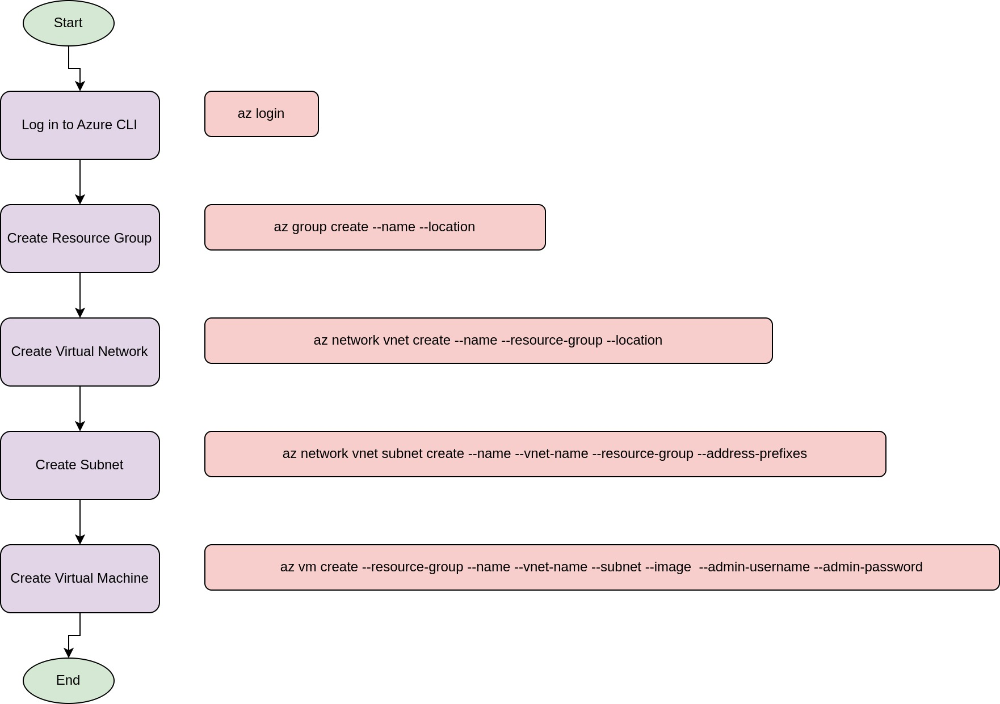

### Level 2: Stark Tech Integration (Intermediate)


---

#### Introduction to Level 2

---

- **Level 2 Theme: Stark Tech Integration**
  - "Welcome to Level 2, Avengers! Now that you've set up the basics, it's time to integrate some Stark tech. In this mission, you'll provision advanced resources and automate deployments using Azure Copilot."

- **Overview of Missions:**
  - "You have three main missions: Build the Iron Server, Deploy the Arc Reactor, and Automate the Helicarrier. Let’s dive into the details!"

---

#### Mission 1 – Build the Iron Server

---

- **Mission Objective:**
  - "Your first mission is to build the Iron Server by provisioning a Virtual Machine (VM) in Azure. This VM will be the powerhouse of your infrastructure."

- **Task Details:**
  - "Use Azure Copilot to provision a VM, select the appropriate size and image, and configure SSH keys for secure access."



---

#### Slide 3: Task Guide – Provisioning a Virtual Machine

---

**Content:**

- **Introduction to Virtual Machine:**
  - "A Virtual Machine in Azure is an on-demand, scalable computing resource. It’s essential for running applications and services."

- **Using Azure Copilot:**
  - "Azure Copilot can help generate the code needed to create and configure a VM."

**Guide:**
  - "To forge the Iron Server, say: 'In Azure’s forge, craft me a machine with Ubuntu's soul, sized to fit a hero’s role.'"



**Challenge:**
  - "Once forged, ensure the server is guarded by a web server’s light. How will you install and verify this beacon of might?"

---

#### Task Guide – Installing a Web Server on the VM

---

**Content:**

- **Introduction to Web Server Installation:**
  - "A web server is crucial for serving your application content over the internet."

- **Using Azure Copilot:**
  - "Azure Copilot can guide you through the steps to install and configure a web server on your VM."

**Guide:**
  - "To light up your Iron Server, whisper: 'Install for me Nginx, and let its flames be seen.'"

**Example Code Snippet:**
```bash
sudo apt update
sudo apt install nginx
sudo systemctl start nginx
sudo systemctl enable nginx
```

**Challenge:**
  - "Verify your beacon by visiting your server’s public IP. Does it shine brightly?"

---

#### Slide 5: Mission 2 – Deploy the Arc Reactor

---

**Content:**

- **Mission Objective:**
  - "Your second mission is to deploy the Arc Reactor by setting up an Azure App Service. This will host your application."

- **Task Details:**
  - "Use Azure Copilot to deploy a sample application to Azure App Service and ensure it is accessible publicly."

**Visuals:**
- Diagram showing the components of Azure App Service.
- Flowchart of the deployment process.

---

#### Task Guide – Deploying to Azure App Service

---

**Content:**

- **Introduction to Azure App Service:**
  - "Azure App Service is a fully managed platform for building, deploying, and scaling web apps."

- **Using Azure Copilot:**
  - "Azure Copilot can help generate the code needed to deploy your application."

**Guide:**
  - "To harness the power of the Arc Reactor, declare: 'Deploy my app to the cloud, where its energy is allowed.'"

**Example Code Snippet:**
```bash
az webapp create --resource-group myResourceGroup --plan myAppServicePlan --name myWebApp --runtime "NODE|14-lts"
```

**Challenge:**
  - "Ensure your Arc Reactor’s energy is accessible. Visit its public URL and see its power."

---

#### Slide 7: Task Guide – Configuring the App Service

---

**Content:**

- **Introduction to App Configuration:**
  - "Proper configuration ensures your application runs smoothly and securely."

- **Using Azure Copilot:**
  - "Azure Copilot can assist in setting the necessary configurations for your App Service."

**Guide:**
  - "To stabilize the Arc Reactor, say: 'Configure my app, so it runs without a flap.'"

**Example Code Snippet:**
```bash
az webapp config set --resource-group myResourceGroup --name myWebApp --always-on true
```

**Challenge:**
  - "Verify the stability by accessing your app’s URL and ensuring continuous power."

---

#### Slide 8: Mission 3 – Automate the Helicarrier

---

- **Mission Objective:**
  - "Your third mission is to automate the Helicarrier by setting up a CI/CD pipeline using Azure DevOps. This pipeline will automate the deployment of your application."

- **Task Details:**
  - "Integrate GitHub, Azure DevOps, and Azure Copilot to configure the pipeline and implement automated CI for the application"

**Visuals:**
- Diagram showing the components of a CI/CD pipeline.
- Flowchart of the CI/CD process.

---

#### Task Guide – Setting Up a CI Pipeline

---

**Content:**

- **Introduction to CI/CD Pipeline:**
  - "A CI/CD pipeline automates the process of building and deploying code changes, ensuring faster and more reliable releases."

- **Using Azure Copilot:**
  - "Azure Copilot can generate the configuration for your CI/CD pipeline."

**Guide:**
  - "To automate the Helicarrier, chant: 'Connect my code to the cloud, let deployments be swift and proud.'"

**Example Steps:**
1. **Integrate Azure DevOps Git with Azure DevOps:**
   - "Link your Azure DevOps Git repository with Azure DevOps using Azure Copilot."
2. **Set Up the Pipeline:**
   - "Create a new pipeline in Azure DevOps and use Azure Copilot to configure it."

---

#### Slide 9: Mission 4 – Automate the Helicarrier (CI Pipeline with Azure DevOps)

- **Mission Objective:**
  - "Your third mission is to automate the Helicarrier by setting up a CI pipeline using Azure DevOps for a Python application."

- **Task Details:**
  - "Use Azure Copilot to create a repository in Azure DevOps, push a Python application code, and set up a CI pipeline on Azure hosted agent."

**Visuals:**
- Diagram showing the components of a CI/CD pipeline.
- Flowchart of the CI pipeline setup process.

---

#### Step 2: Creating a Repository in Azure DevOps

**Guide:**

- "To set the stage for the Helicarrier, whisper: 'Create the repo, and let the code flow.'"

**Steps:**

1. **Create a New Repository:**
    - Navigate to your Azure DevOps project.
    - Go to "Repos" > "Files".
    - Click on "New repository".
    - Enter the repository name `my-python-app` and create it.

2. **Clone the Repository Locally:**
    - Copy the clone URL.
    - Open your terminal and run the following command:
      ```bash
      git clone https://dev.azure.com/<your-organization>/<your-project>/_git/my-python-app
      ```
    - Navigate to the cloned directory:
      ```bash
      cd my-python-app
      ```

**Challenge:**
- "Push the code to the repo with ease. How will you ensure it is done with peace?"

3. **Push Python Application Code to Repository:**
    - Copy the provided Python application code into the `my-python-app` directory.
    - Initialize the Git repository:
      ```bash
      git init
      ```
    - Add the files to the repository:
      ```bash
      git add .
      ```
    - Commit the changes:
      ```bash
      git commit -m "Initial commit of Python application"
      ```
    - Push the changes to Azure DevOps:
      ```bash
      git push origin master
      ```

---

#### Step 3: Setting Up a CI Pipeline

**Guide:**

- "To build the Helicarrier’s might, say: 'Create the pipeline, and let it ignite.'"

**Steps:**

1. **Navigate to Pipelines:**
    - Go to "Pipelines" in Azure DevOps.
    - Click on "New pipeline".

2. **Select Repository:**
    - Choose "Azure Repos Git".
    - Select the `my-python-app` repository.

3. **Configure Pipeline:**
    - Select "Starter pipeline" and replace the content with the following Python pipeline configuration:

```yaml
trigger:
- master

pool:
  vmImage: 'ubuntu-latest'

steps:
- task: UsePythonVersion@0
  inputs:
    versionSpec: '3.x'
    addToPath: true

- script: |
    python -m pip install --upgrade pip
    pip install -r requirements.txt
  displayName: 'Install dependencies'

- script: |
    python app/main.py
  displayName: 'Run application'
```

4. **Save and Run:**
    - Click "Save and run".
    - Commit directly to the `master` branch with a commit message like "Add CI pipeline".
    - Observe the pipeline run.

**Challenge:**

- "Ensure the pipeline builds without a hitch. How will you make sure there's no glitch?"

---

#### Step 4: Verifying the CI Pipeline

**Guide:**

- "To confirm the Helicarrier's flight, declare: 'Verify the build, and ensure it’s right.'"

**Steps:**

1. **Verify Pipeline Success:**
    - Check the pipeline run status in Azure DevOps.
    - Ensure all steps are green and the build is successful.

2. **Review Build Artifacts:**
    - Go to the pipeline run summary.
    - Check the "Logs" section to ensure the Python script ran successfully and produced the expected output.

**Challenge:**

- "Ensure the build is successful and green. What steps will you take to keep it clean?"

---

#### Quick Recap

---

**Content:**

- **Mission Recap:**
  - "Fantastic work, Avengers! You have successfully built the Iron Server, deployed the Arc Reactor, and automated the Helicarrier using Azure Copilot."

- **Q&A Session:**
  - "Do you have any questions or need further clarification on any of the tasks? Let’s discuss your experiences and any challenges you faced."

**Visuals:**
- Summary slide with icons representing each completed task.
- Space for participants to ask questions and share feedback.