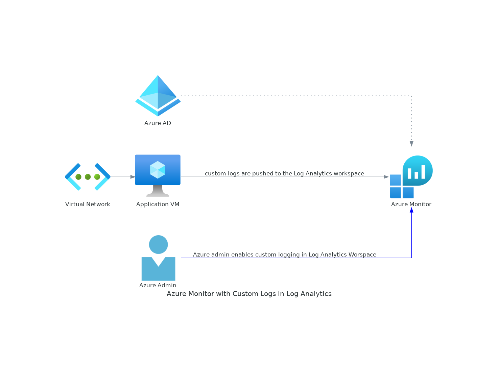

### Level 3: Battle the Villains (Advanced)

**Objective:** Troubleshoot and optimize Azure infrastructure and DevOps processes using Azure Copilot.


**Theme:** Taskmaster Loki will challenge you to defend against his mischief by ensuring your Azure resources are well-monitored, secure, and optimized for performance.

---

### Mission 1: Defend Against Ultron's Mischief (Monitoring and Alerts)

**Task:** Setting Up Diagnostic Settings and Monitoring Alerts on VMs

**Guide:**
- "To foresee Ultron's tricks, set up alerts quick. How will you keep an eye on your Iron Server?"

**Steps:**

#### Setting Up Diagnostic Settings:

1. **Navigate to the VM in Azure Portal:**
   - Use Azure Copilot to open the Azure Portal and navigate to the Virtual Machine you want to monitor.

2. **Enable Diagnostic Settings:**
   - Click on "Diagnostic settings" under the "Monitoring" section.
   - Click "Add diagnostic setting."
   - Name your diagnostic setting.
   - Check the boxes for metrics and logs you want to monitor.
   - Select the destination for the diagnostic logs (e.g., Log Analytics workspace, Storage account, Event Hub).
   - Click "Save."

#### Creating Monitoring Alerts:

1. **Navigate to Alerts:**
   - In the Azure Portal, navigate to the "Monitor" service.
   - Click on "Alerts" in the sidebar.

2. **Create New Alert Rule:**
   - Click on "New alert rule."
   - Select the VM as the resource to monitor.
   - Click "Next: Condition."
   - Choose a signal such as "Percentage CPU" for the condition.
   - Configure the condition logic (e.g., CPU > 80%).
   - Click "Next: Actions."
   - Create or select an action group to notify stakeholders.
   - Click "Next: Details."
   - Name your alert rule and provide a description.
   - Click "Create alert rule."

**Challenge:**
- "Ultron's tricks are sly, set up alerts to defy. How will you know when the CPU is too high?"



---

### Mission 2: Simulate and Resolve Issues

**Task:** Simulating an Issue and Resolving It (Linux and Windows VMs)

**Guide:**

- "To battle my mischief and keep your systems fine, simulate issues and solve them in time."

**Steps for Linux VM:**

1. **Simulate CPU Spike:**
   - SSH into the VM.
   - Run a command to simulate a CPU spike:
     ```bash
     yes > /dev/null &
     ```

2. **Resolve the Issue:**
   - Identify the process causing the spike using `top` or `htop`.
   - Kill the process:
     ```bash
     kill <process_id>
     ```

**Steps for Windows VM:**

1. **Simulate High CPU Usage:**
   - RDP into the VM.
   - Open PowerShell and run:
     ```powershell
     while ($true) { "" }
     ```

2. **Resolve the Issue:**
   - Open Task Manager.
   - End the high CPU usage process.

**Challenge:**
- "When CPU usage is high, find the culprit and let it die. What commands will you use to get by?"

---

### Mission 3: Shield from Ultron (Security Enhancements)

**Task:** Mitigating Security Vulnerabilities (Linux and Windows VMs)

**Guide:**

- "Ultron lurks in your VMs' seams. Strengthen your defenses to thwart his schemes."

**Steps for Linux VM:**

1. **Enable Firewall:**
   - Use Azure Copilot to configure and enable `ufw`:
     ```bash
     sudo ufw enable
     sudo ufw allow ssh
     ```

2. **Update System Packages:**
   - Update the package list and upgrade packages:
     ```bash
     sudo apt update
     sudo apt upgrade -y
     ```

**Steps for Windows VM:**

1. **Enable Firewall:**
   - Use Azure Copilot to configure Windows Firewall to allow necessary ports.

2. **Install Security Updates:**
   - Check for and install Windows updates.

**Challenge:**
- "Ultron’s threat is real, ensure your firewalls are a steel shield. How will you update to secure the field?"

---

### Mission 4: Optimize the Quinjet (Performance Tuning and Scaling)

**Guide:**
- "To outrun the enemies and stay ahead, tune and scale your VMs with nothing to dread."

**Steps for Linux and Windows VMs:**

#### Resizing the VM:

1. **Navigate to VM Settings:**
   - Use Azure Copilot to open the Azure Portal and navigate to the VM you want to resize.

2. **Resize VM:**
   - Click on "Size" under the "Settings" section.
   - Select a new VM size from the list based on your requirements.
   - Click "Resize."

#### Enabling Auto-scaling:

1. **Create a Scale Set:**
   - Navigate to "Virtual machine scale sets" in the Azure Portal.
   - Click "Create" to create a new scale set.
   - Follow the prompts to configure the scale set (resource group, region, etc.).

2. **Configure Auto-scaling Rules:**
   - After the scale set is created, click on "Scaling" under the "Settings" section.
   - Click "Add a rule."
   - Define the scale-out rule (e.g., add more instances when CPU > 75%).
   - Define the scale-in rule (e.g., remove instances when CPU < 25%).
   - Save the auto-scaling configuration.

**Challenge:**
- "To keep your VM performance pristine, what steps will you take to make it mean?"

---

### Mission 5: Measuring Performance Impact

**Guide:**
- "After tuning and scaling your VMs with might, check the performance metrics to ensure they’re right."

**Steps:**

#### Collecting Performance Metrics:

1. **Open Azure Monitor:**
   - Use Azure Copilot to navigate to the "Monitor" service in the Azure Portal.

2. **View VM Metrics:**
   - In Azure Monitor, click on "Metrics" in the sidebar.
   - Select the VM as the resource to monitor.
   - Choose metrics such as "Percentage CPU," "Disk I/O," "Network In/Out."
   - Add these metrics to the chart.

3. **Generate Performance Reports:**
   - Use the "Add metric" button to include all relevant metrics.
   - Customize the chart to view performance over specific time intervals.
   - Save and export the performance reports.

#### Analyzing Metrics:

1. **Compare Performance:**
   - Compare the performance metrics before and after tuning and scaling.
   - Identify any remaining bottlenecks or areas needing improvement.

**Challenge:**
- "Measure your VMs' performance without slack. What commands will you use to keep them on track?"